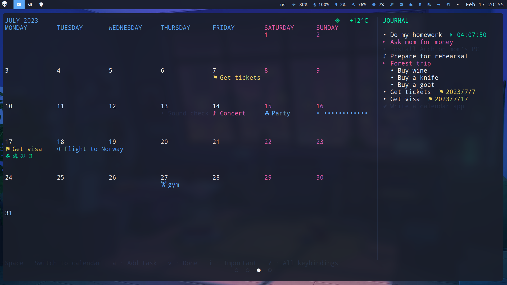

# Calcure

Modern TUI calendar and task manager with customizable interface. Manages your events and tasks, displays birthdays from your [abook](https://abook.sourceforge.io/), and can import events and tasks from [calcurse](https://github.com/lfos/calcurse) and [taskwarrior](https://github.com/GothenburgBitFactory/taskwarrior).

[See documentation](https://anufrievroman.gitbook.io/calcure/) for more information.

## Features

- Vim keys
- View tasks and events from .ics files synced with clouds
- Operation with fewest key presses possible
- Todo list with subtasks, deadlines, and timers
- Birthdays of your abook contacts
- Import of events and tasks from calcurse and taskwarrior
- Icons according to the name ✈ ⛷ ⛱
- Private events and tasks •••••
- Plain text database in your folder for cloud sync
- Customizable colors, icons, and other features
- Resize and mobile friendly
- Current weather ⛅
- Support for Persian calendar

## Installation

### Linux and Mac OS

`pip install calcure`

### Windows

1. Install `Windows Terminal` app from the app store
2. Install `python 3.x` also from the app store (if you just type `python` in the Windows Terminal app it will offer you to install)
3. Install the program and libraries by typing in the Windows Terminal `pip install windows-curses calcure`
4. Now you can finally run it by typing in the Windows Terminal `python -m calcure`

### Upgrade to the most recent version

`pip install --upgrade calcure`

### Dependencies

- `python` 3.7 and higher
- `holidays`, `jdatetime`, and `ics` python libraries.

## Usage

Run `calcure` in your terminal. You may need to restart your terminal after the install.

### Syncing with cloud calendars

[This page in documentation](https://anufrievroman.gitbook.io/calcure/syncing-with-clouds) shows examples how to sync and display in read-only mode events and tasks from Nextcloud, Google, and other calendars. 

### User arguments

[Various user arguments](https://anufrievroman.gitbook.io/calcure/user-arguments) can be added started in special mods add tasks and events etc.

### Key bindings

[List of all key bindings](https://anufrievroman.gitbook.io/calcure/key-bindings) can be accessed in the wiki and via `?` key in the program.

### Settings

[Example of config.ini file](https://anufrievroman.gitbook.io/calcure/default-config) and [explanations of all settings](https://anufrievroman.gitbook.io/calcure/settings) are available in the documentation.
On the first run, program will create a `config.ini` file where you can edit parameters, colors, and icons at `~/.config/calcure/config.ini`.

### Troubleshooting

[Typical problems and solutions](https://anufrievroman.gitbook.io/calcure/troubleshooting) are described in documentation. If you faced a new problem, don't hesitate to open an issue.

## Contribution, translations, donations

[Full information about contribution](https://anufrievroman.gitbook.io/calcure/contribution) is available in the documentation.

If you'd like to support the development, consider [donations](https://www.buymeacoffee.com/angryprofessor).

