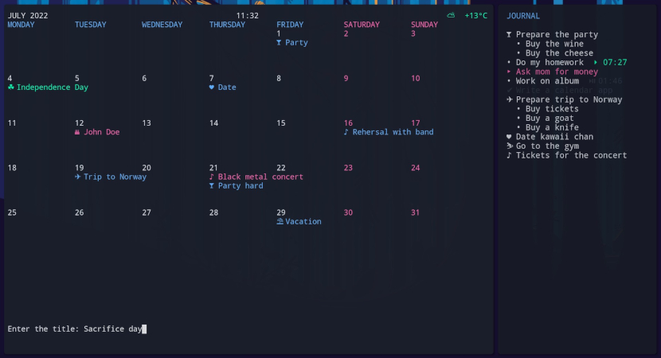

# Calcure

Modern TUI calendar and task manager with customizable interface. Manages your events and tasks, displays birthdays from your [abook](https://abook.sourceforge.io/), and can import events and tasks from [calcurse](https://github.com/lfos/calcurse) and [taskwarrior](https://github.com/GothenburgBitFactory/taskwarrior).



## Features

- Vim keys
- Operation with fewest key presses possible
- Todo list with subtasks and timers ⌚
- Birthdays of your abook contacts
- Import of events and tasks from calcurse and taskwarrior
- Icons according to the name ✈ ⛷ ⛱
- Privat events and tasks •••••
- Plain text database in your folder for cloud sync
- Customizable colors, icons, and other features
- Resize and mobile friendly
- Week can start on any day
- Current weather ⛅
- Support for Persian calendar


## Installation

### On Linux and Mac OS

`pip install calcure`


### On Arch Linux, Manjaro etc

The package `calcure` is available in AUR. 

`yay -S calcure`

Also, you need to install `holidays` and `jdatetime` libraries:

`pip install holidays jdatetime`


### On Windows

1. Install `Windows Terminal` app from the app store
2. Install `python 3.x` also from the app store (if you just type `python` in the Windows Terminal app it will offer you to install)
3. Install the program and libraries libraries by typing in the Windows Terminal `pip install holidays windows-curses calcure`
4. Now you can finally run it by typing in the Windows Terminal `python -m calcure`


## Dependencies

To run, it only requires python 3. On Linux and MacOS, you should have it by default, but if you don't, install `python` package from your standard repository. 

However, you may also need to install holidays and jdatetime libraries as `pip install holidays jdatetime`.


## Usage

Run `calcure` in your terminal. 

### User arguments

`-c` · Start on the calendar page (default)

`-j` · Start on the journal page

`-i` · Start using Persian calendar

`-h` · Start on the help page

`-p` · Start in the privacy mode (text is obfuscated as •••••)

`-v` · Print the version and exit

`--folder=FOLDERNAME` - Use datafiles (events and tasks) stored in a specific folder. For example, if you want to have separate databases for work and for personal things, you can start as `calcure --folder=$HOME/.calcure/work` or `calcure --folder=$HOME/.calcure/personal`. The same effect can basically be achived with the `--config` argument, as explained below.

`--config=CONFIGFILE.ini` - Use specific config file instead of the default one. For example, if you want to separate not only datafiles, like in the previous example, but other settings too, you can run program with alternative config as `calcure --config=$HOME/.config/calcure/config2.ini`. If the specified config file does not exist, it will be created with default settings.

## Keybindings

Besides keybindings listed below, various vim-style keybinding (`ZZ`, `ZQ` etc) and dedicated buttons (`home` etc) are supported as well.

### General

`space` · Switch between calendar and tasks

`/` · Toggle split screen

`*` · Toggle privacy mode

`?` · Show keybindings

`q` · quit


### Calendar view

`n`,`l`,`↓`  · Next month

`p`,`k`,`↑` · Previous month

`a` · Add an event

`A` · Add a recurring event

`h` · Mark/unmark an event as high priority

`l` · Mark/unmark an event as low priority

`d`,`x` · Delete an event

`e` · Edit an event

`m` · Move an event

`.` · Toggle privacy of an event

`g` · Go to selected day

`C` · Import events from Calcurse

`G` - return to current month


### Tasks view

`a` · Add a task

`A` · Add a subtask

`v` · Mark a task as done

`V` · Mark all tasks as done

`u` · Unmark a task

`U` · Unmark all tasks

`h` · Mark/unmark a task as important

`H` · Mark/unmark all tasks as important

`l` · Mark/unmark a task as low priority

`L` · Mark/unmark all tasks as low priority

`.` · Toggle privacy of a task

`d` · Delete a task and all its subtasks

`D` · Delete all tasks

`t` · Start / pause timer for a task

`T` · Remove a timer

`m` · Move a task

`s` · Toggle between task and subtask

`e` · Edit a task

`C` · Import tasks from Calcurse

`W` · Import tasks from Taskwarrior


## Configuration

On the first run, it will create a configuration file at `.config/calcure/config.ini`

You can edit parameters and colors in the `config.ini` file. Here is an example config (don't forget to change *username*):

```
[Parameters]
folder_with_datafiles = /home/username/.config/calcure
calcurse_todo_file = /home/username/.local/share/calcurse/todo
calcurse_events_file = /home/username/.local/share/calcurse/apts
taskwarrior_folder = /home/username/.task
default_view = calendar
birthdays_from_abook = Yes
show_keybindings = Yes
privacy_mode = No
show_weather = No
weather_city = 
minimal_today_indicator = Yes
minimal_days_indicator = Yes
minimal_weekend_indicator = Yes
show_calendar_boarders = No
cut_titles_by_cell_length = No
ask_confirmations = Yes
use_unicode_icons = Yes
show_current_time = No
show_holidays = Yes
show_nothing_planned = Yes
holiday_country = UnitedStates
use_persian_calendar = No
start_week_day = 1
weekend_days = 6,7
refresh_interval = 1
split_screen = Yes
right_pane_percentage = 25
journal_header = JOURNAL
event_icon = •
privacy_icon = •
today_icon = •
birthday_icon = ★
holiday_icon = ☘️
hidden_icon = ...
done_icon = ✔
todo_icon = •
important_icon = ‣
timer_icon = ⌚
separator_icon = │

[Colors]
color_today = 2
color_events = 7
color_days = 4
color_day_names = 4
color_weekends = 1
color_weekend_names = 1
color_hints = 7
color_prompts = 7
color_confirmations = 1
color_birthdays = 1
color_holidays = 2
color_todo = 7
color_done = 6
color_title = 4
color_calendar_header = 4
color_important = 1
color_unimportant = 6
color_timer = 2
color_timer_paused = 7
color_time = 7
color_weather = 2
color_active_pane = 2
color_separator = 7
color_calendar_border = 7
color_background = -1

[Styles]
bold_today = No
bold_days = No
bold_day_names = No
bold_weekends = No
bold_weekend_names = No
bold_title = No
bold_active_pane = No
underlined_today = No
underlined_days = No
underlined_day_names = No
underlined_weekends = No
underlined_weekend_names = No
underlined_title = No
underlined_active_pane = No

[Event icons]
travel = ✈
plane = ✈
voyage = ✈
flight = ✈
airport = ✈
trip = 🏕
vacation = ⛱
holiday = ⛱
day-off = ⛱
hair = ✂
barber = ✂
beauty = ✂
nails = ✂
game = ♟
match = ♟
play = ♟
interview = 🎙️
conference = 🎙️
hearing = 🎙️
date = ♥
concert = ♪
dance = ♪
music = ♪
rehearsal = ♪
call = 🕻
phone = 🕻
zoom = 🕻
deadline = ⚑
over = ⚑
finish = ⚑
end = ⚑
doctor = ✚
dentist = ✚
medical = ✚
hospital = ✚
party = ☘
bar = ☘
museum = ⛬
meet = ⛬
talk = ⛬
sport = ⛷
gym = 🏋
training = ⛷
email = ✉
letter = ✉

```

When configuring colors, the numbers indicate standard colors of your terminal and usually mean: 

1 · red, 2 · green, 3 · yellow, 4 · blue, 5 · magenta, 6 · cyan, 7 · white, -1 · transparent

## Troubleshooting

- If you cannot install the program using proposed commands, try manually coping `calcure` file on your computer, making it executable (via file properties) and running it from terminal `./calcure`.
- If your terminal shows empty squares instead of icons, probably it does not support unicode. In this case, in config set: `use_unicode_icons = No`.
- Weather widget slows down launch of the program and requires internet. If that is a problem, switch weather off in config: `show_weather = No`.
- If weather is incorrect, set your city in config `weather_city = Tokyo`. By default, this setting is empty and program tries to detect your city automatically.

## Contribution and donations

If you wish to contribute, feel free to open issues or propose PRs. Particularly, you are welcome to contribute on the topics of file encryption, sycing with popular calendar services, and translations. For big changes, please open an issue to discuss first. If you'd like to support the development, consider [donations](https://www.buymeacoffee.com/angryprofessor).
