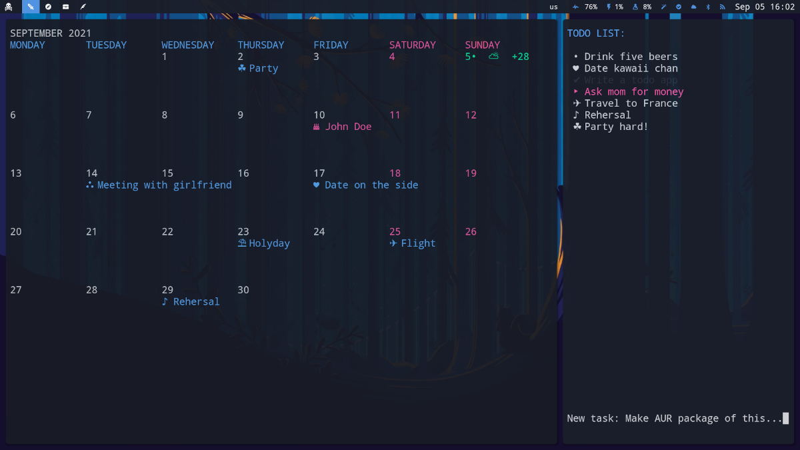

# Minimalist TUI Calendar
Minimal calendar with stylish and customizable UI in linux terminal. You can add and edit events and view birthdays from your [abook](https://abook.sourceforge.io/).



## Instalation and running
Simply copy the _mincal_ file into a directory with your binaries, for example into `home/user/.local/bin` 

Then, run by just typing `mincal` in a linux terminal.

## Key bindings

`n` - next month

`p` - previous month

`a` - add event

`e` - edit event

`d` - delete event

`i` - toggle footer

`q` - quit


## Configuration

On the first run, it will create a configuration file at `home/user/.config/mincal/config.ini`

You can edit parameters and colors in the `config.ini` file. Here is an example config:

```
[Parameters]
folder_with_datafile = /home/John/.config/mincal
birthdays_from_abook = Yes
show_keybindings = No
show_day_names = Yes
minimal_today_indicator = Yes
minimal_days_indicator = Yes
minimal_weekend_indicator = Yes
delete_confirmation = No
display_icons = Yes
event_icon = •
today_icon = •
birthday_icon = ★

[Colors]
color_today = 2
color_days = 7
color_day_names = 4
color_weekends = 1
color_weekend_names = 1
color_hints = 7
color_promts = 7
color_birthdays = 1

[Day names]
mon = MONDAY
tue = TUESDAY
wed = WEDNESDAY
thu = THURSDAY
fri = FRIDAY
sat = SATURDAY
sun = SUNDAY

[Month names]
jan = JANUARY
feb = FEBRUARY
mar = MARCH
apr = APRIL
may = MAY
jun = JUNE
jul = JULY
aug = AUGUST
sep = SEPTEMBER
oct = OCTOBER
nov = NOVEMBER
dec = DECEMBER

[Diologs]
hint =  n - next month • p - previous month • a - add event • d - delete • e - edit • q - quit • i - toggle hints

[Event icons]
travel = ✈
plane = ✈
trip = ✈
voyage = ✈
flight = ✈
airport = ✈
vacation = ⛱
holyday = ⛱
day-off = ⛱
hair = ✂
barber = ✂
beauty = ✂
nails = ✂
game = ♟
match = ♟
play = ♟
interview = ♟
date = ♥
concert = ♫
gig = ♫
disco = ♫
music = ♫
rehersal = ♫
call = ☎
phone = ☎
deadline = ⚑
over = ⚑
finish = ⚑
end = ⚑
appointment = ✔
task  = ✔
doctor = ⛑
dentist = ⛑
medical = ⛑
hospital = ⛑
party = ☘
museum = ⛬
meet = ⛬
talk = ⛬
conference = ⛬
hearing = ⛬
sport = ⛷
gym = ⛷
training = ⛷
```
When configuring colors, numbers mean: 1 - red, 2 - green, 3 - yellow, 4 - blue, 5 - magenta, 6 - cyan, 7 - white

## Other programs
For similar minimalist terminal expirience, check out my [todo app](https://github.com/anufrievroman/minimalist-tui-todo).
